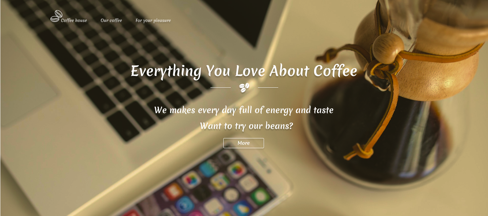

# Coffee House☕

- [✅Deployed Project](https://coffee-house-bagtirr.vercel.app)
- [📐Template](https://www.figma.com/file/Iu4Lul87WvzdM5CXFwE4qtZ6/Coffee-shop?node-id=0%3A1&t=CoIgYEL8RhxuoPSe-1)
- SPA Template for coffee shop  
- Practical project for the React course🎓

## ⚙ Technologies
- JS (ES6)
- Redux Toolkit + RTK Query
- React Router
- React Lazy
- Hooks
- React Helmet
- Framer Motion
- HTML5 + BEM
- SCSS
- RWD

## 💡 Features
- Product list
- Best products
- Filter coffee by country
- Search coffee by name
- Product page
- Navigation for mobile devices
- Error and Loading handling
- Responsive layout
- animations
